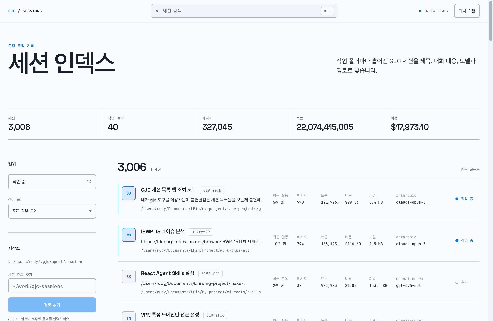
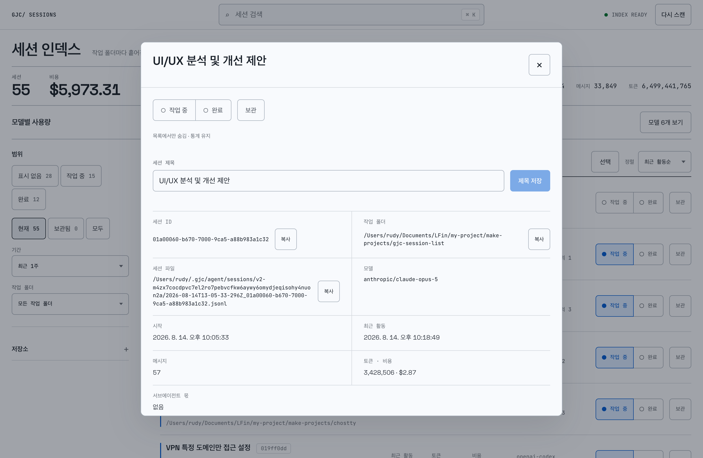
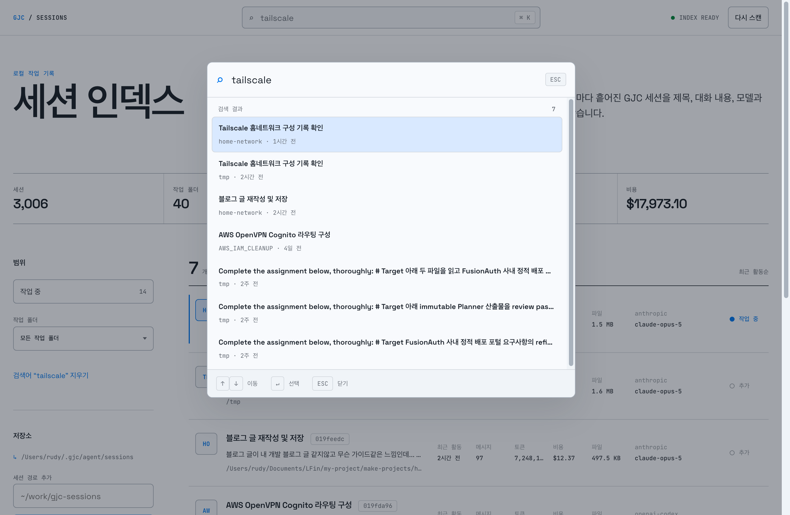

# GJC Sessions

작업 폴더마다 흩어진 GJC 세션 JSONL을 한 화면에서 찾고, 열어 보고, 정리하는 로컬 웹 도구입니다.

`gjc stats`는 사용량 통계만 주고 세션 목록 API는 없습니다. 이 도구는 세션 JSONL을 직접 읽어 제목·대화 내용·모델·경로로 검색할 수 있는 인덱스를 만듭니다. 서버는 `127.0.0.1`에만 바인딩하며, 세션 내용은 이 컴퓨터를 벗어나지 않습니다.

> 한 가지 예외: 화면 글꼴을 Google Fonts에서 불러옵니다(`index.html`의 `<link>`). 완전한 오프라인이 필요하면 그 줄을 지우고 시스템 글꼴로 폴백시키세요. 세션 데이터가 나가는 것은 아닙니다.



## 무엇을 하나

검색은 제목만 훑지 않습니다. 대화 본문과 작업 폴더 경로, 모델명까지 한 인덱스에 넣어 두고 찾습니다. 공백으로 나눈 여러 단어는 AND로 묶입니다.

지금 붙잡고 있는 세션에는 "작업 중" 표시를 답니다. 사이드바에서 그 세션만 추려 보고, 표시 자체는 세션 원본이 아니라 별도 설정 파일에 저장합니다.

기본 경로 밖에 세션이 있으면 환경변수와 CLI, UI 어느 쪽으로든 폴더를 더합니다.

세션이 3,000개를 넘어도 화면은 가상 스크롤로 보이는 행만 그립니다. 서버는 50개씩 끊어 보냅니다.

### 상세 보기

행을 클릭하면 목록에서 잘렸던 정보 전체와 세션 파일 경로, 마지막 사용자·어시스턴트 대화가 열립니다. 같은 화면에서 제목을 바꾸거나 세션을 지웁니다. 원본을 직접 건드리지 않고 GJC 공식 세션 API를 거칩니다.



### 검색 팔레트

`⌘K` / `Ctrl+K` 로 어디서나 엽니다. `↑` `↓` 이동, `↵` 선택, `ESC` 닫기.



## 요구 사항

| 항목 | 용도 | 필수 여부 |
| --- | --- | --- |
| Node.js | 서버·빌드·테스트 | 필수 (v22.14.0에서 검증) |
| GJC 세션 JSONL | 읽을 대상 | 필수 |
| Bun + `@gajae-code/coding-agent` | 제목 변경·삭제 | 선택 |

제목 변경과 삭제는 GJC가 설치된 패키지의 `SessionManager` / `FileSessionStorage`를 Bun으로 호출합니다. Bun이나 GJC 패키지가 없으면 조회·검색·북마크는 그대로 되고 변경·삭제만 실패합니다.

## 실행

```bash
npm install
npm run build
npm start
```

`http://127.0.0.1:4175` 을 엽니다.

개발 중에는 Vite 미들웨어가 붙은 모드로 실행합니다. 상시 서비스와 겹치지 않게 `4176`을 씁니다.

```bash
npm run dev
```

상시 띄워 둔다면 아래 **상시 실행** 을 쓰세요. 개발 모드는 Vite 변환 비용을 계속 물고 갑니다.

## 상시 실행 (macOS)

`scripts/service.sh` 가 빌드하고 LaunchAgent로 등록합니다. 등록하면 로그인할 때마다 자동으로 뜨고, 죽으면 launchd가 다시 띄웁니다.

```bash
./scripts/service.sh install    # 빌드 + 등록 + 시작
./scripts/service.sh status     # 등록·실행·응답 상태
./scripts/service.sh stop       # 지금 종료
./scripts/service.sh start      # 지금 시작
./scripts/service.sh restart
./scripts/service.sh update     # 코드 바꾼 뒤 재빌드 + 재시작
./scripts/service.sh logs 100
./scripts/service.sh uninstall  # 자동 시작 해제
```

`stop` 은 지금 멈출 뿐이고 다음 로그인에 다시 뜹니다. 자동 시작을 아예 끄려면 `uninstall` 입니다.

포트를 바꾸려면 `GJC_SESSION_LIST_PORT=5000 ./scripts/service.sh install` 처럼 지정한 뒤 등록하세요.

| 항목 | 위치 |
| --- | --- |
| LaunchAgent | `~/Library/LaunchAgents/com.gjc.session-list.plist` |
| 표준 출력 | `~/Library/Logs/gjc-session-list.out.log` |
| 표준 오류 | `~/Library/Logs/gjc-session-list.err.log` |

plist에는 `node`와 `bun`의 절대 경로가 박힙니다. launchd는 로그인 셸의 `PATH`를 물려받지 않기 때문입니다. nvm으로 node 버전을 올렸다면 경로가 바뀌니 `install` 을 다시 실행하세요. `status` 가 그 상황을 잡아 알려 줍니다.

## 세션 경로 설정

기본값은 `~/.gjc/agent/sessions` 입니다. 홈 디렉터리 전체를 훑지 않으니 다른 위치는 직접 알려 줘야 합니다.

```bash
# 환경변수 (단일)
GJC_SESSION_DIR=/path/to/sessions npm start

# 환경변수 (여러 개, OS 경로 구분자)
GJC_SESSION_DIRS="/path/one:/path/two" npm start

# CLI (반복 지정 가능)
npm start -- --session-dir /path/one --session-dir /path/two
```

UI 좌측 **저장소 → 세션 경로 추가** 로 넣은 경로는 `~/.gjc/session-list.json` 에 저장돼 다음 실행에도 유지됩니다.

| 환경변수 | 뜻 |
| --- | --- |
| `PORT` | 수신 포트 (`npm start`·서비스는 `4175`, `npm run dev`는 `4176`) |
| `GJC_SESSION_DIR` | 세션 폴더 하나 추가 |
| `GJC_SESSION_DIRS` | 세션 폴더 여러 개 추가 (OS 경로 구분자, POSIX는 `:`) |
| `GJC_CODING_AGENT_DIR` | GJC 에이전트 디렉터리 (기본 `~/.gjc/agent`) |
| `GJC_PACKAGE_DIR` | GJC 패키지 위치 직접 지정 (자동 탐색 실패 시) |

## 동작 방식

첫 요청에서 두 단계로 인덱싱합니다. 먼저 각 JSONL의 첫 줄만 읽어 제목과 경로, 시각을 만들고 목록을 바로 띄웁니다. 그 다음 백그라운드에서 전체를 파싱해 대화 검색용 텍스트와 토큰·비용을 채웁니다. 진행률은 상단에 표시됩니다.

결과는 `~/.cache/gjc-session-list/index-v2.json.gz` 에 gzip으로 저장합니다. 다음 실행에서는 파일 크기와 `mtime`이 그대로인 세션을 다시 파싱하지 않습니다.

파일 감시자는 두지 않습니다. 갱신 시점은 서버 시작, **다시 스캔** 버튼, 세션 경로 추가 세 가지뿐입니다.

### 실측치

3,006개 세션 / Apple M3 Pro / 캐시가 있는 상태:

| 항목 | 값 |
| --- | --- |
| 첫 목록 응답 | 약 0.8초 |
| 인덱싱 완료 | 약 4.1초 |
| 캐시 크기 | 약 33 MB |
| 인덱싱 중 최대 메모리 | 약 730 MB |
| 유휴 메모리 | 약 220 MB |
| 유휴 CPU | 30초간 0.04초 (사실상 0) |

캐시가 없는 첫 실행은 전체 파싱이 필요해 더 걸립니다. 인덱싱 중 메모리가 크게 뛰는 것은 캐시를 직렬화·압축하는 구간 때문입니다.

## 데이터

| 경로 | 내용 | 지워도 되나 |
| --- | --- | --- |
| `~/.gjc/agent/sessions/**.jsonl` | 세션 원본 | 지우지 마세요. 이 도구는 읽기만 하고, 제목 변경·삭제 요청에만 GJC API로 수정합니다 |
| `~/.gjc/session-list.json` | 추가한 세션 경로, 작업 중 표시 목록 | 지우면 북마크와 경로 설정이 사라집니다 |
| `~/.cache/gjc-session-list/index-v2.json.gz` | 검색 인덱스 캐시 | 언제든 지워도 됩니다. 다음 실행에 다시 만듭니다 |

## API

전부 `127.0.0.1` 로컬 전용입니다.

| 메서드 | 경로 | 설명 |
| --- | --- | --- |
| `GET` | `/api/sessions` | 목록. `q`, `folder`, `focus=1`, `offset`, `limit`(≤100), `summaryOnly=1`, `refresh=1` |
| `GET` | `/api/sessions/:id` | 상세 + 마지막 대화 |
| `PATCH` | `/api/sessions/:id` | 제목 변경. 본문 `{ "title": "..." }` (1~120자, 제어문자 불가) |
| `DELETE` | `/api/sessions/:id` | 삭제. 본문 `{ "confirm": "<세션 ID>" }` 가 정확히 일치해야 합니다 |
| `PUT` | `/api/focus/:id` | 작업 중 표시 |
| `DELETE` | `/api/focus/:id` | 작업 중 해제 |
| `POST` | `/api/directories` | 세션 경로 추가. 본문 `{ "path": "..." }` |

제목 변경과 삭제는 인덱싱이 끝난 뒤에만 받습니다 (진행 중이면 `409`).

## 테스트

```bash
npm test
```

`session-scanner.test.js` 는 JSONL 파싱·필터·캐시 무효화·`header_patch` 반영을 검증합니다. `server.test.js` 는 임시 홈 디렉터리와 임시 세션 파일로 서버를 띄워 제목 변경 → 잘못된 확인값 거부 → 삭제 → 설정 정리까지 실제 API로 확인합니다. 사용자의 실제 세션은 건드리지 않습니다.

## 구성

| 파일 | 역할 |
| --- | --- |
| `server.js` | HTTP 서버, API, 인덱스 수명주기, 캐시 |
| `session-scanner.js` | JSONL 파싱, 폴더 탐색, 검색 필터 |
| `scripts/service.sh` | LaunchAgent 등록·시작·종료 |
| `src/main.jsx` | React UI 전체 |
| `src/styles.css` | 화면 스타일 |
| `tokens.css` | 디자인 토큰 원본 |
| `design.md` | 고정된 디자인 시스템 — UI 변경 전에 먼저 읽습니다 |

## 라이선스

MIT. [`LICENSE`](LICENSE) 참고.

Gajae Code 공식 프로젝트가 아닙니다.
